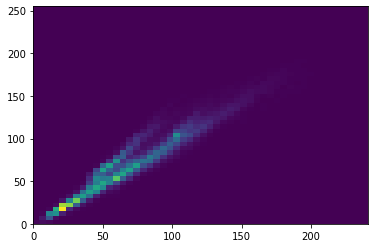

# Domain background :
Image recognition is a branch of computer vision and artificial Intelligence. The main idea is detect distinguish object on image, recognise object and identify object on image. There are different tasks that image recognition can perform: Classification, Tagging, detection and segmentation. The goal on this project is used deep learning to classify dogs and cats images. 

# Problem statement: 
In this competition, you'll write an algorithm to classify whether images contain either a dog or a cat.  This is easy for humans, dogs, and cats. Your computer will find it a bit more difficult.
In this competition, you'll write an algorithm to classify whether images contain either a dog or a cat.  This is easy for humans, dogs, and cats. Your computer will find it a bit more difficult.

Deep Blue beat Kasparov at chess in 1997.
Watson beat the brightest trivia minds at Jeopardy in 2011.

# Datasets and inputs:
Web services are often protected with a challenge that's supposed to be easy for people to solve, but difficult for computers. Such a challenge is often called a CAPTCHA (Completely Automated Public Turing test to tell Computers and Humans Apart) or HIP (Human Interactive Proof). HIPs are used for many purposes, such as to reduce email and blog spam and prevent brute-force attacks on web site passwords.
Asirra (Animal Species Image Recognition for Restricting Access) is a HIP that works by asking users to identify photographs of cats and dogs. This task is difficult for computers, but studies have shown that people can accomplish it quickly and accurately. Many even think it's fun! Here is an example of the Asirra interface:
Asirra is unique because of its partnership with Petfinder.com, the world's largest site devoted to finding homes for homeless pets. They've provided Microsoft Research with over three million images of cats and dogs, manually classified by people at thousands of animal shelters across the United States. Kaggle is fortunate to offer a subset of this data for fun and research. 
The train data have 12500 images of cats and 12500 images of dog. The followed images chows the percentage of dog and cat images.

The following images show the dog and cat image with their corresponding 2d histograms 

 

The different between images are significant due to image back drown and lightness. 
We can find on our data several dog which look like cat because of dog size such as shihuahua. 

The following table show the statistics description on image size in MB. The sizes of dog and cat image are close event if we compare the quartiles. 
Based on standard deviation, we can say that the cat images size is more homogenous than dog image size.  

Figure 1: Descriptive statistics of image size en MB.

Image is recorder in three different colors. The following image shows the cat and dog image on different colors.
  
 
 

Sample of train data:

Cat image	

 

Dog image

  	 
	

Both images can bring some anomaly because on cat image the cat does not appear clearly and on dog image we do not clearly identify dog on image. 

# Solution statement:
This is a Kaggle problem, several people work on this project in order to increase the accuracy and reduce the percentage of wrong prediction. The propose solution is provide the model based on CNN to distinguish Dogs VS Cats images. I used Pandas to load and explore data. The main objective here is have more than 80% of accuracy and provide the code and model used to distinguish dogs and cats image. 

# Benchmark model:
The current literature suggests machine classifiers can score above 80% accuracy on this task [http://xenon.stanford.edu/~pgolle/papers/dogcat.pdf]. Therfore, Asirra is no longer considered safe from attack.  We have created this contest to benchmark the latest computer vision and deep learning approaches to this problem. 
My goal is to improve the result of this paper and create the lasting peace between cats and dogs. This means propose the model which can reach on the accuracy higher than 80%. 

# Evaluation metrics:
Performance is evaluated on the percentage of correctly labelled images. 50% of train data is dog and another 50% is cat. In the case of balance data the metrics used to define the model performance will be accuracy. "But classification accuracy is a flawed metric!" you scream at your monitor in fury, "my genius requires you accept the posterior probability of my predictions!"  That may be true, but sometimes simplicity is just nice. Here there are only dogs and cats... no 0.5 dog-cat hybrid guesses allowed!

# Project design:

    - Programming language: Python 3.6, 
    - Library: Keras, Tensorflow, Pandas, Numpy, matplotlib, seaborn, scikit-learn
    - Workflow:
        - Data understanding
            - Data exploration and visualisation (matplotlid and seeborn)
            - Validate the rate of dog and cat
            - Check the image size  
            - Used keras ImageDataGenerator to pre-process data.
        - Train test split (train_test_split for scikit-learn)
            - Prepared labelled images to train model
            - Take 80% image for training and 20% for testing
            - Check the cat, dog rate of train and test data
        - Modelling (keras)
            - Design the model 
            - Training the model to able to classify images
        - Predict and evaluate model on test image 

I will start by this model:

- model = keras.models.Sequential([
    - keras.layers.Conv2D(filters=64, kernel_size=3, strides=(1,1), padding='valid',activation= 'relu', input_shape=(128,128,3)),
    - keras.layers.MaxPooling2D(pool_size=(2,2)),
    - keras.layers.Conv2D(filters=128, kernel_size=3, strides=(2,2), padding='same', activation='relu'),
    - keras.layers.MaxPooling2D(pool_size=(2,2)),
    - keras.layers.Conv2D(filters=64, kernel_size=3, strides=(2,2), padding='same', activation='relu'),
    - keras.layers.MaxPooling2D(pool_size=(2,2)),
    - keras.layers.Flatten(),
    - keras.layers.Dense(units=128, activation='relu'),
    - keras.layers.Dropout(0.10),                         
    - keras.layers.Dense(units=2, activation='softmax')])
